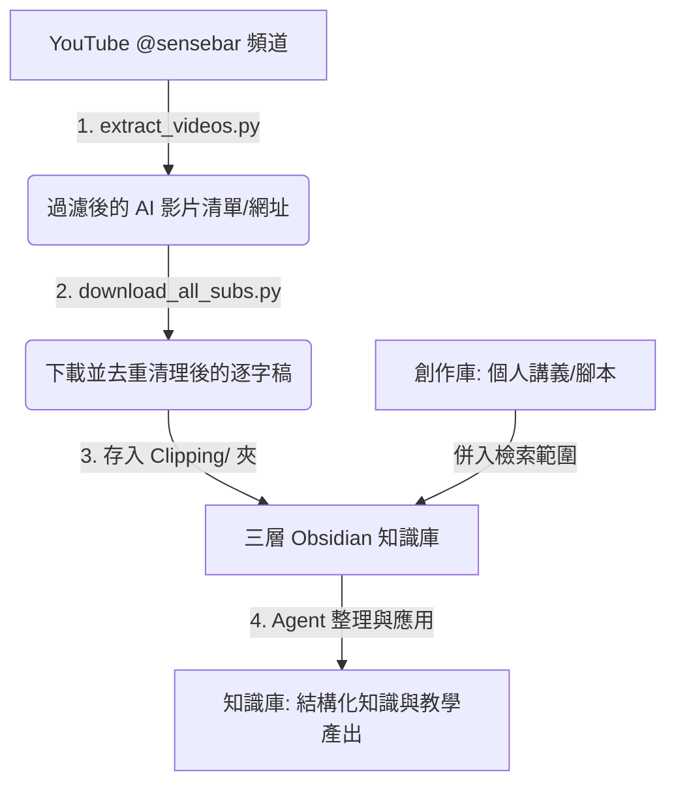

# Sensebar Agent 知識庫構建工作流 (CLAUDE.md)

## 📌 核心規則與查詢指南
當使用者詢問以下主題時，**必須優先檢索並查閱 `Clipping/` 資料夾中的逐字稿**，再根據其內容進行精準回答，不得憑空推論：
- 三師爸（Sense Bar）的教學方法、觀點與工作流程。
- @sensebar 頻道影片及直播的具體提及內容。
- 三師爸對特定 AI Agent 工具（Claude Code、Codex、AntiGravity、OpenCode）的評價與實測結論。

---

## 🗺️ 工作流秒懂圖表與步驟

### 📋 步驟與意義說明表

| 步驟 | 執行腳本 / 動作 | 產出檔案 / 目標路徑 | 核心意義與價值 |
| :--- | :--- | :--- | :--- |
| **Step 1** | `python extract_videos.py` | `sensebar_ai_urls.txt` `sensebar_ai_videos.md` `sensebar_all_videos.md` | **精準過濾**：自動掃描頻道中所有影片與直播，依關鍵字（claude, codex...）篩選出 AI 相關影片，建立資料索引。 |
| **Step 2** | `python download_all_subs.py` | `Clipping/` 資料夾內的 Markdown 檔案 | **自動化採集與清洗**：使用 `yt-dlp` 下載字幕，自動去除 VTT 時間戳記與 HTML 標籤，並**去重重疊滾動字串**，生成乾淨的筆記。 |
| **Step 3** | **建立三層知識庫架構** | `Clipping/` (外部來源) `創作庫/` (個人原創) `知識庫/` (結構化整理) | **第二大腦標準化**：將原始資料與個人創作分離，建立清晰的資料邊界，供 AI Agent 進行高效整理與檢索（RAG）。 |
| **Step 4** | **Agent 定期重組與應用** | `知識庫/` 中的主題索引與輸出 | **知識內化與下游任務**：AI 讀取前兩層資料，自動生成領域教學計畫、考古題解析，或生成 HTML 教學網頁並部署至 Netlify/GitHub Pages。 |

---

## 💡 如何做會更有成效、更有效率？（優化與提效指南）

當使用者表示「不懂」、「卡關」或需要優化時，應主動提示以下優化策略：

1. **成效優化 (Effectiveness)**：
   - **建立核心索引 (Index.md)**：在`知識庫/`中建立一個 `Index.md`，由 Agent 定期將 `Clipping/` 的新逐字稿摘要並連結到 `知識庫/` 的主題節點（例如：`AI 工作流/`、`提示詞技巧/`），形成網狀 Obsidian 知識圖譜。
   - **雙向連結 (Backlinks)**：在 `創作庫/` 的個人講義中，使用 `[[影片檔名#關鍵段落]]` 連結回 `Clipping/` 的原始資料，確保隨時可追溯三師爸的原始觀點。
   - **結合本地檢索 (RAG)**：在對話中直接讓 Agent 讀取整個 `Clipping/` 目錄，避免手動複製貼上。

2. **效率優化 (Efficiency)**：
   - **增量下載 (Resumable)**：`download_all_subs.py` 已內建「已存在則跳過」機制。更新頻道時，只需重新執行 Step 1，然後跑 Step 2 即可，不會重複下載舊影片，省時省流量。
   - **批次自動化**：可使用 `schedule` 工具或 Windows 批次檔（`.bat`）將 Step 1 & 2 封裝，實現一鍵自動更新。
   - **使用 Python `uv` 加速**：執行 Python 腳本時，建議使用 `uv run` 來自動管理依賴，避免本地 `pip` 環境衝突。
